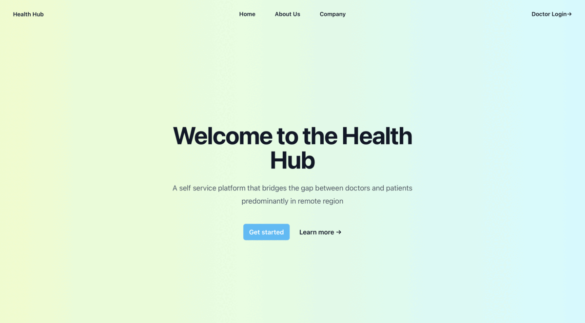

# Health Hub
Health Hub is a web-based remote medical records system built using TypeScript and React. The system uses Google Cloud Vision to handle patient login and signup, and allows patients to create medical records with data fields for systolic blood pressure (sys mmHg), diastolic blood pressure (dia mmHg), and pulse rate per minute. The system uses a custom YOLOv5 object detection model to capture these data fields.

On the doctor side, doctors can view, approve, and annotate the medical records of patients that they are assigned to. The system provides a secure and efficient way for doctors to manage their patients' medical records and track their progress over time.

## Screenshots

# Getting Started
To get started with Health Hub, follow these steps:

Clone the repository:

### `git clone https://github.com/StevenAttipoe/health-hub-client.git`
Install the dependencies:

### `cd health-hub`
### `npm install`
Start the development server:

### `npm start`
This will start the development server on http://localhost:3000. You should be able to see the Health Hub login page in your web browser

# Features
Health Hub includes the following features:

1. Patient login and signup using Google Cloud Vision
2. Medical record creation using a custom YOLOv5 object detection model
3. Data fields for systolic blood pressure, diastolic blood pressure, and pulse rate per minute
4. Doctor dashboard for viewing, approving, and annotating patient medical records

# Technologies Used
Health Hub is built using the following technologies:

TypeScript
1. React
2. Google Cloud Vision
3. YOLOv5 object detection model

# Fork the repository
Create a new branch for your feature or bug fix
Make your changes and commit them to your branch
Push your changes to your forked repository
Submit a pull request to the main repository